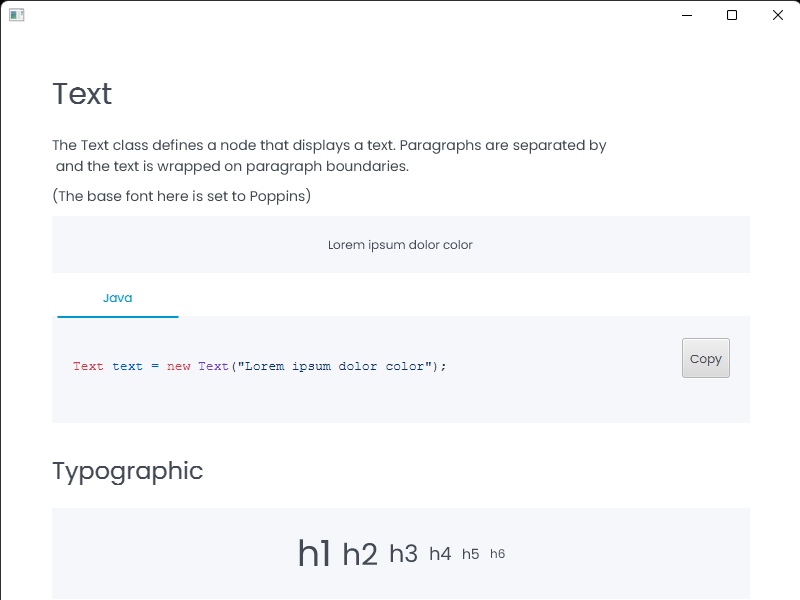

# Presentation Creator

## 📑 Overview
The idea behind this component is to create a top-down structure like a document.

## Style
The base class PresentationCreator uses a declarative style like this
```java
    PresentationCreator = new PresentationCreator()
        ...
        .build();
```

As you grow up, you can pass components like this
```java
    PresentationCreator = new PresentationCreator()
        .title("")
        .build()
        .getRoot(); // Here you can get the root node
```
Getting typographic

```java
    PresentationCreator = new PresentationCreator()
        .h1("h1") // the title component is the same and have the h1 class to style
        .h2("h2")
        ...
        .h6("h6")
        .build()
        .getRoot(); // Here you can get the root node
```
## See others
```java
    PresentationCreator = new PresentationCreator()
        .image(new Image("avatar.jpg")) // tha can be responsive, (cover)
        .demo(new Button("Demo")) // a single demonstration of a component
        .code("code") // A portion of code that uses hightlighted 
        .demonstration(new Button("Demo"), "java code") // That can be detailed whit a portion of code 
        .demonstration(new Button("Demo"), "java code", "fxml code", "css code") // Create tabs to navigate
        .build()
        .getRoot(); // Here you can get the root node
```

## System of parents
```java
    PresentationCreator = new PresentationCreator()
        .h1("Title One")
        .h2("Title two", "Title One") // heres second parameters act likes root to future navigation
        .build()
        .getRoot(); // Here you can get the root node
```
## See with some style


